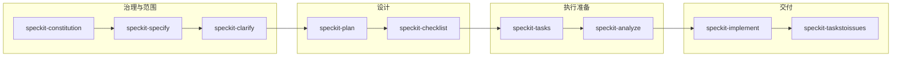

# Spec Kit（Speckit）技能说明：阶段、用途与用法

本文说明 **9 个 `speckit-*` 技能**各自对应**软件开发的哪一阶段**、解决什么问题、以及如何调用。运行 [`init-spec-kit`](../README.md) 后，本文件会出现在项目 **`docs/speckit-skills-guide-zh.md`**（与仓库内源文件同步打包）。

- **Cursor**：技能在 **`.cursor/skills/`**；使用 **`--locale zh`** 时另有 **`.cursor/commands/`** 中文入口。
- **Claude Code**：技能在 **`.claude/skills/`**；**`init-spec-kit --agent claude`**；**`--locale zh`** 时为中文版 `SKILL.md`（无 `.cursor/commands` 包）。
- **Codex CLI**：技能在 **`.agents/skills/`**；**`init-spec-kit --agent codex`**；上游以 **`$speckit-*`** 形式引用技能名；**`--locale zh`** 时同样写入中文版 `SKILL.md`。
- 技能 **`name` 字段**与英文版一致，便于工具识别；说明文字在中文包中为中文。

---

## 一、总览：推荐工作顺序

Spec Kit 把「规格驱动开发」拆成可重复执行的步骤。下面是一条**从立项到实现**的推荐主线；带「可选」的技能可按项目需要跳过。

| 顺序建议 | 技能 ID | 类型 | 典型阶段（你在做什么） |
|---------|---------|------|------------------------|
| 1 | `speckit-constitution` | 建议首做 | 项目/迭代开始：定原则与约束 |
| 2 | `speckit-specify` | 主线 | 需求：把想法写成可评审的规格 |
| 3 | `speckit-clarify` | 可选 | 需求评审前：消歧义、补漏 |
| 4 | `speckit-plan` | 主线 | 架构/方案：技术上下文、研究、契约 |
| 5 | `speckit-checklist` | 可选 | 方案后：需求质量检查清单 |
| 6 | `speckit-tasks` | 主线 | 开发排期：拆任务、标依赖 |
| 7 | `speckit-analyze` | 可选 | 开工前：spec/plan/tasks 一致性只读分析 |
| 8 | `speckit-implement` | 主线 | 编码与验证：按 tasks 实现 |
| 9 | `speckit-taskstoissues` | 可选 | 协作：把任务同步到 GitHub Issues |

> **说明**：`speckit-clarify` 官方推荐在 **`speckit-plan` 之前**完成；`speckit-analyze` 在 **`speckit-tasks` 完成之后、`speckit-implement` 之前**最有价值。

---

## 二、如何在 Cursor 里「使用」技能

1. **安装技能树**  
   在仓库根执行：`init-spec-kit` 或 `init-spec-kit --locale zh`（中文技能 + 可选 `.cursor/commands` 入口）。

2. **打开项目**  
   用 Cursor 打开该仓库，确保 `.cursor/skills/` 已存在。

3. **唤起技能**  
   - 在 **Agent / Chat** 中通过 Cursor 的 **Skills**（技能）面板或等价入口，选择 **`speckit-…`** 对应技能。  
   - 若使用 **`--locale zh`** 且存在 **`.cursor/commands/`**，也可通过 **自定义命令** 列表选择同名条目（正文会引导模型加载对应 `SKILL.md`）。

4. **输入上下文**  
   在对话里用**自然语言**描述当前功能、约束、已有文档路径等；部分技能依赖 **`specs/<功能目录>/`** 下的 `spec.md`、`plan.md`、`tasks.md`，需先完成前置步骤。

5. **产物位置**  
   默认规格目录在 `specs/` 下（具体子目录由 `speckit-specify` 与 `.specify/feature.json` 等解析）；脚本在 `.specify/scripts/`（bash 或 PowerShell，随平台）。

---

## 三、各技能分说明

### 1. `speckit-constitution` — 项目宪章

| 项目 | 说明 |
|------|------|
| **开发阶段** | 项目启动、重大方向变更、或迭代开始前 — **治理 / 非功能约束**定调。 |
| **解决什么问题** | 把「团队必须遵守的原则」（安全、性能、测试、发布等）写成 `.specify/memory/constitution.md`，并让后续模板（plan/spec/tasks）与之对齐。 |
| **典型输入** | 原则草案、团队约定、合规要求；也可在对话中逐步补充。 |
| **典型输出** | 更新后的宪章文件、版本号与同步影响说明；可能触发对模板一致性的检查。 |
| **用法提示** | 新仓库建议**最先**运行；宪章变更后，再跑 `speckit-plan` / `speckit-specify` 时模型应自动对照宪章。 |

---

### 2. `speckit-specify` — 功能规格（Spec）

| 项目 | 说明 |
|------|------|
| **开发阶段** | **需求分析与规格化** — 把「要做什么」写成结构化 `spec.md`，尚未涉及具体代码设计。 |
| **解决什么问题** | 从自然语言生成/更新功能目录、`spec.md`、需求质量清单入口；限定澄清数量，避免无限追问。 |
| **典型输入** | 功能的一句话描述 + 业务背景；可选：目录名、分支名等特殊要求。 |
| **典型输出** | `specs/<前缀>-<短名>/spec.md`、`.specify/feature.json`、检查清单文件等（以技能内步骤为准）。 |
| **用法提示** | 每个功能通常跑一次「完整 specify」；后续小改可在同目录上增量更新。下一环节多为 **`speckit-clarify`（可选）** 或 **`speckit-plan`**。 |

---

### 3. `speckit-clarify` — 规格澄清（可选）

| 项目 | 说明 |
|------|------|
| **开发阶段** | **需求评审前** — 在写技术方案前，把 `spec.md` 里模糊点收敛掉。 |
| **解决什么问题** | 用少量高价值问题（官方上限量级）识别歧义，把结论**写回** `spec.md`，降低后续返工。 |
| **前置条件** | 已有 `speckit-specify` 产出的 `spec.md`。 |
| **典型输入** | 可空；或指出你最担心的模糊点（安全、范围、角色等）。 |
| **用法提示** | 若规格已足够清晰可跳过；若将跳过，应意识到 **`speckit-plan` 返工风险**会增加。 |

---

### 4. `speckit-plan` — 实现计划（Plan）

| 项目 | 说明 |
|------|------|
| **开发阶段** | **技术设计** — 在规格稳定后，产出 `plan.md`、`research.md`、数据模型、契约、quickstart 等设计资产。 |
| **解决什么问题** | 把「怎么做」落到文档与目录约定里；运行 `setup-plan` 脚本解析路径；更新 Cursor 规则里对「当前 plan」的引用。 |
| **前置条件** | `spec.md` 就绪；宪章可读。 |
| **典型输入** | 技术栈偏好、约束、必须引用的现有模块。 |
| **典型输出** | `plan.md`、研究/模型/契约等 Phase 0–1 产物（以技能步骤为准）。 |
| **用法提示** | 与 **`speckit-specify` 同一功能目录**；完成后可接 **`speckit-checklist`（可选）** 再进入 **`speckit-tasks`**。 |

---

### 5. `speckit-checklist` — 需求质量清单（可选）

| 项目 | 说明 |
|------|------|
| **开发阶段** | **设计完成后、拆任务前** — 把「需求写得够不够好」做成可勾选清单（**不是**测代码）。 |
| **解决什么问题** | 针对当前功能生成/细化检查项：完整性、可测性、边界、一致性等，类似「需求的单元测试」。 |
| **前置条件** | 已有 spec/plan/tasks 中至少一部分；技能会结合可用文档生成清单。 |
| **典型输入** | 你最关心的风险域（安全、无障碍、性能门禁等）。 |
| **用法提示** | 清单项应可客观判断 true/false；通过后再 `speckit-tasks` 更稳。 |

---

### 6. `speckit-tasks` — 任务分解（Tasks）

| 项目 | 说明 |
|------|------|
| **开发阶段** | **迭代规划 / 开发排期** — 把设计与规格变成可执行、有依赖顺序的 `tasks.md`。 |
| **解决什么问题** | 按用户故事、优先级、技术栈生成阶段化任务；标出可并行项与阻塞关系。 |
| **前置条件** | `plan.md` + `spec.md` 为主；其它设计文件越多越好。 |
| **典型输入** | 里程碑、人力、必须包含的测试类型等。 |
| **典型输出** | `tasks.md`（路径由 `check-prerequisites` 与功能目录解析）。 |
| **用法提示** | 完成后建议跑 **`speckit-analyze`（可选）** 再 **`speckit-implement`**。 |

---

### 7. `speckit-analyze` — 交叉分析（可选，只读）

| 项目 | 说明 |
|------|------|
| **开发阶段** | **`tasks.md` 已就绪、编码开始前** — 最后一次「文档层 QA」。 |
| **解决什么问题** | **只读**比对 `spec.md`、`plan.md`、`tasks.md`：不一致、重复、遗漏、与宪章冲突；**不修改任何文件**。 |
| **前置条件** | 三份核心文档齐全且路径可被脚本解析。 |
| **典型输入** | 分析侧重点（例如只关心安全相关一致性）。 |
| **典型输出** | 结构化分析报告（严重级别 + 证据摘录 + 建议）；是否采纳修复由你决定。 |
| **用法提示** | 宪章冲突视为 **CRITICAL**；若需改原则应走 **`speckit-constitution`**，而非在 analyze 里「绕过」宪章。 |

---

### 8. `speckit-implement` — 按任务实现

| 项目 | 说明 |
|------|------|
| **开发阶段** | **编码与集成** — 真正改代码、补测试、更新任务勾选状态。 |
| **解决什么问题** | 按 `tasks.md` 顺序实现；若存在 `checklists/` 且未完成，会提示是否仍继续。 |
| **前置条件** | `tasks.md`、`plan.md`；建议 checklist 与分析已完成。 |
| **典型输入** | 当前要实现的任务范围、环境限制、禁止修改的目录等。 |
| **用法提示** | 可多次调用分阶段推进；大改动注意与 CI/评审节奏对齐。 |

---

### 9. `speckit-taskstoissues` — 任务转 GitHub Issue（可选）

| 项目 | 说明 |
|------|------|
| **开发阶段** | **协作与跟踪** — 把已整理好的任务同步到 **GitHub Issues**（需远程为 GitHub 且具备创建 Issue 的能力，如 MCP）。 |
| **解决什么问题** | 在正确仓库中为每条任务建 Issue，便于看板、指派与外链追踪。 |
| **前置条件** | `git remote` 为 GitHub；任务列表已解析；**严禁**在与 remote 不一致的仓库创建 Issue。 |
| **典型输入** | Issue 模板偏好、标签规则等。 |
| **用法提示** | 仅当团队工作流依赖 GitHub Issue 时使用；注意权限与仓库边界。 |

---

## 四、与「开发阶段」对照的速查表

| 阶段（通俗说法） | 主要技能 | 辅助/可选技能 |
|------------------|-----------|----------------|
| 定规矩 | `speckit-constitution` | — |
| 写需求 | `speckit-specify` | `speckit-clarify` |
| 做方案 | `speckit-plan` | `speckit-checklist` |
| 拆工作 | `speckit-tasks` | `speckit-analyze` |
| 写代码 | `speckit-implement` | — |
| 同步看板 | `speckit-taskstoissues` | — |

---

## 五、维护与定制

- 技能正文位于仓库 **`.cursor/skills/<id>/SKILL.md`**；使用本仓库 **`init-spec-kit --locale zh`** 时，中文版本来自上游的 [`locales/zh/`](../locales/zh/README.md) 覆盖层。  
- 若需与公司流程对齐，可在自有分支中修改 `SKILL.md` 后重新打包 zip（见 [`scripts/build_locale_zh_zips.py`](../scripts/build_locale_zh_zips.py)）并重建 `init-spec-kit`。

以上内容描述的是 **Spec Kit 推荐工作流**；具体字段名、脚本参数以各 `SKILL.md` 内说明为准。
